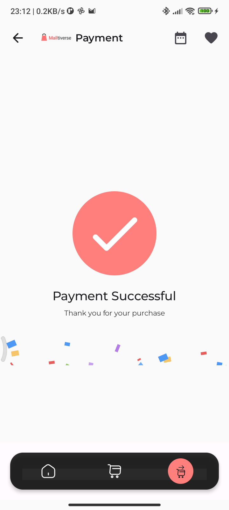

## Malltiverse
An E-Commerce Android application that consumes the [Timbu API](https://docs.timbu.cloud/api/intro).

## Wireframes
- [Figma](https://www.figma.com/design/QHq9WbFOHgdDRhPuLOTNvB/HNG-INTERNSHIP?node-id=142-292&t=LGp1Sxxln6UcvMQn-0)

## Demo
- [Appetize](https://appetize.io/app/b_tsatn2vrgbsrvo7avhymsvujni)
- Go to releases for the [APK](https://github.com/slowburn-404/Malltiverse/releases/tag/v1.0.1)

## Features
- List products by category.
- Favourite/add to wishlist.
- Add/remove products to/from carts.
- Local data persistence of wishlist.
- Save completed orders locally.
- Simulated payment flow.

## Architecture Overview
- The application utilizes the Model-View-ViewModel (MVVM) architecture pattern. The Model ([Data layer](app/src/main/java/dev/borisochieng/malltiverse/data/)) is responsible for data retrieval from the API and SQLite Database and uses the repository pattern. It uses mappers to transform data layer objects to domain layer objects.
- The [Domain](app/src/main/java/dev/borisochieng/malltiverse/domain/) contains objects used it the Presentation layer. It also uses mapper to transform the objects to data layer objects.
- The [Presentation layer](app/src/main/java/dev/borisochieng/malltiverse/presentation/) wraps the View, which consists of [Activities](https://developer.android.com/guide/components/activities/intro-activities) made up of UI elements called Composables, and the ViewModel, holds the state for the screen (View) and data retrieved from the Model.

<div style="text-align: center;">
    
</div>

## Technology Stack
- **[Kotlin](https://kotlinlang.org/)**: The official programming language for developing Android applications.
- **[Jetpack Compose](https://developer.android.com/develop/ui/compose)**: A modern UI toolkit for building Android applications in Kotlin.
- **[Retrofit](https://github.com/square/retrofit)**: A HTTP client for Android used to make network calls to the Timbu API.
- **[Coil](https://coil-kt.github.io/coil/)**: A lightweight image loading library.
- **[Coroutines](https://developer.android.com/kotlin/coroutines#:~:text=A%20coroutine%20is%20a%20concurrency,established%20concepts%20from%20other%20languages)**: A concurrency design pattern in Kotlin used to make asynchronous network calls (on a background thread).
- **[Gson](https://github.com/google/gson)**: A library used to convert Kotlin objects to and from JSON objects (serialization and deserialization).
- **[OkHttp](https://square.github.io/okhttp/)**: A HTTP client library for Android and Java applications used to make network requests.
- **[OkHttp Logging Interceptor](https://github.com/square/okhttp/tree/master/okhttp-logging-interceptor)**: Used for logging HTTP request and response data.
- **[ViewModel](https://developer.android.com/topic/libraries/architecture/viewmodel)**: A lifecycle-aware Android Architecture Component for holding state.
- **[Room Persistence Library](https://developer.android.com/training/data-storage/room)**: Android Jetpack Library for local data caching.

## Screenshots





## Setup Instructions

1. **Clone the repository to your local machine.**
```bash
git clone https://github.com/slowburn-404/HNGInternship.git

cd Malltiverse
```
2. **Open in Android Studio**
- Open Android Studio
- Select `File` > `Open...`

3. **Retrieve an API Key for authentication.**
- Create an account on [Timbu Cloud](http://timbu.cloud/).
- Follow this [guide](https://docs.timbu.cloud/api/Api-Keys/create-apikeys) to retrieve your API Key and App ID.

4. **Retrieve the `organization_id`**
- On your Timbu Dashboard, navigate to Settings > Advanced and you will find your Organization ID.
- In the root directory of your project, add the API Key, App ID, and the Organization ID to the `local.properties` file.

```
apiKey=YOUR_API_KEY
orgID=YOUR_ORGANIZATION_ID
appID=YOUR_APP_ID
```
5. **Build and run the app**
- Ensure your Android device or emulator is set up.
- Click on the `Run` button or use `Shift + F10`.

## License
This project is licensed under the Apache-2.0 License. See the [LICENSE](./LICENSE) file for more details.
